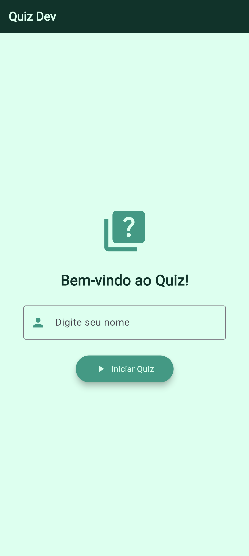
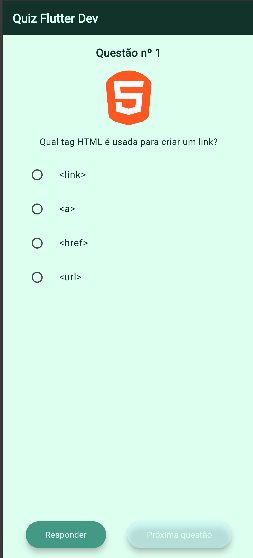
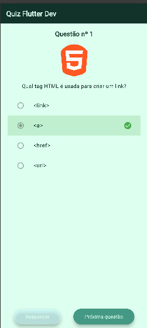

# Flutter Quiz 2026

Quiz interativo desenvolvido com Flutter e Dart, com perguntas de múltipla escolha, feedback visual de acerto/erro e tela de resultado personalizada.

---

## Como rodar o projeto

**Pré-requisitos:** ter o Flutter instalado. Se não tiver, siga o guia oficial: https://docs.flutter.dev/get-started/install

```bash
# 1. Clone o repositório
git clone https://github.com/EnzoToniato567/Quiz-Flutter-2026.git

# 2. Entre na pasta do projeto
cd flutter_quiz_2026

# 3. Instale as dependências
flutter pub get

# 4. Rode o app
flutter run
```

---

## Tecnologias utilizadas

- Flutter
- Dart
- VS Code
- Git
- GitHub

---

## Screenshots

<div align="center">

| Splash | Quiz | Resultado |
|--------|------|-----------|
|  |  |  |

</div>